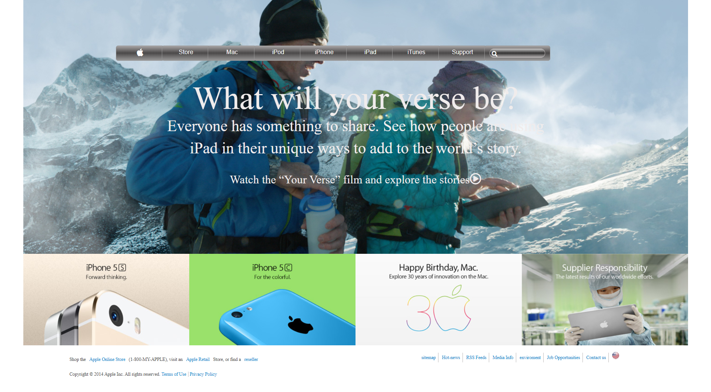

# HTML & CSS: Copy of old version of apple.com

> This project consists of building a webpage using images as a background and adding gradients to elements. 

## Built With

- HTML
- CSS

## Live Demo

[Apple-Clone]

## Authors

👤 **Lamia Sristy**

- Github: [@LamiaSristy](https://github.com/LamiaSristy)

## Show your support

Give a ⭐️ if you like this project!

## 📝 License

This project is [MIT](lic.url) licensed.
